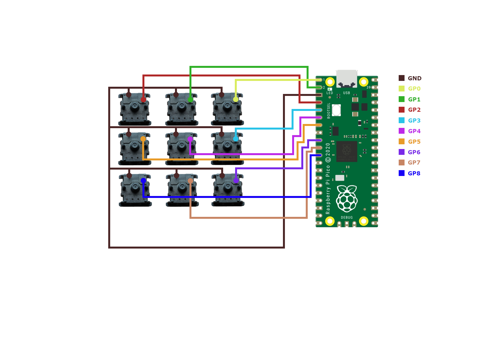

# What's Needed:
* 1x a RP2040-Macro-Pad case (mine was printed with resolution of 0.13 and infill 50%)
* 1x a RP2040 (any variant of the board will fit)
* 9x Mechanical keyboard switches
* 9x keycaps of your choice
* 1x a switch opener (optional)
* 4x M3 bolts (1cm long)
* wires
* soldering equipment
* a hot-glue gun
* a USB cable

# RP2040-Macro-Pad GPIO Pinout:

# Steps:
* Gather all the required components and tools from What's Needed
* Put the RP2040 board into bootloader mode and install [CircuitPython](https://circuitpython.org/board/raspberry_pi_pico/)
* Solder the cables according to the pinout diagram mentioned above
* Copy the files from the code folder to the RP2040
* Attach the RP2040 board to the case using hot-glue
* Secure the case by using the M3 bolts
* Congratulations! The assembly is complete. Now, you can define your own key mappings in the code.py file. The list of keycodes (keycode.py) and media controls (consumer_control_code.py) can be found in the lib\adafruit_hid directory
* Optional: If you are using Windows, you can remove the RP2040 storage letter in the computer management to make it appear as a regular macro pad

RP2040-Macro-Pad is based on [Sebastian Proost Project](https://www.thingiverse.com/thing:4816077)

# If you like my work consider giving tip

0x558243239Edbc454D2eAAd9c5E2966Fd8dE0Baa7
